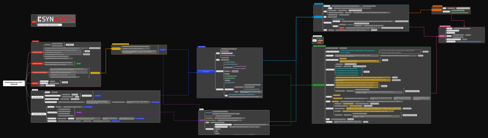

# Pentesting Azure Mindmap 

Get the Global Admin access 💥 with this mindmap for Azure penetration tests. 

Feel free to pull request with your techniques ! ❤️

Developed by Alexis Danizan   
Released as open source by [Synacktiv 🥷](https://www.synacktiv.com/) 

📖 Resources
-----

Useful resources used to build this mindmap, many outstanding works:

- [PayloadsAllTheThings - Cloud - Azure](https://github.com/swisskyrepo/PayloadsAllTheThings/blob/master/Methodology%20and%20Resources/Cloud%20-%20Azure%20Pentest.md)
- [ROADtools](https://github.com/dirkjanm/ROADtools)
- [AzureHound](https://github.com/BloodHoundAD/AzureHound)
- [AADInternals](https://github.com/Gerenios/AADInternals)
- [Powerzure](https://github.com/hausec/PowerZure)
- [HackTricks Cloud](https://github.com/carlospolop/hacktricks-cloud)
